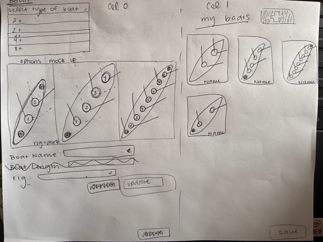
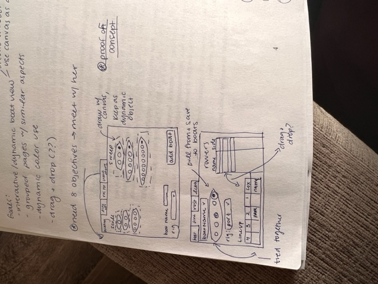
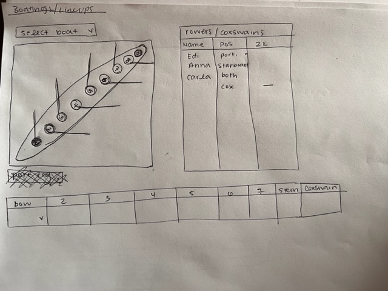
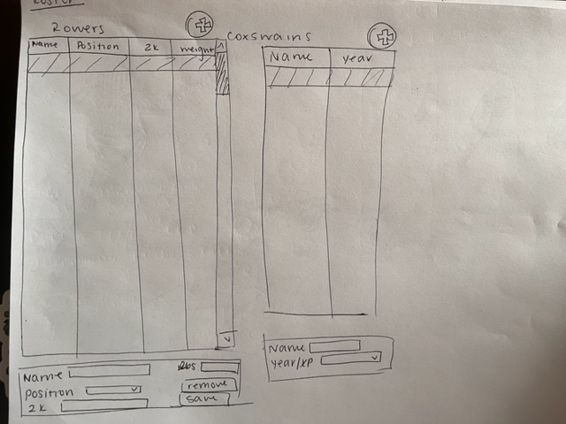
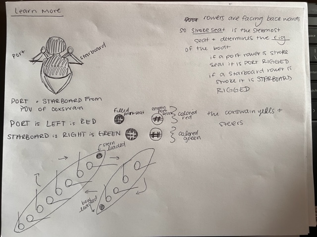
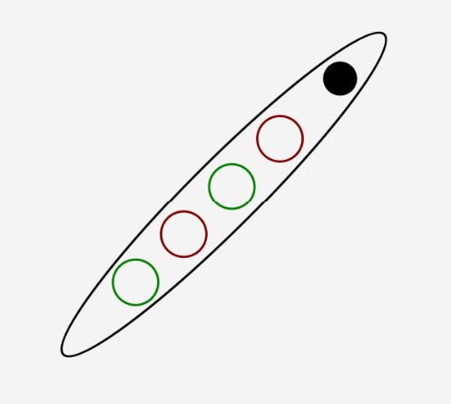

# Final Application Proposal: Rowing Interface
## Rowing Background:
Since this is a niche topic, we thought to include an overview of how a rowing ecosystem looks. The first thing to know about are coxswains. These are the people that sit in the boat and whose job is to tell the rowers what to do, steer the boat, and provide statistics to the rowers; they are essentially the brain of the boat. The next thing to know about are the boats. There are many different kinds of boats. Some have coxswains and some do not. The boats that we will aim to capture are 2x, 2+, 4x, 4+, 8+. The number represents the quantity of rowers in the boat, and the ‘x’ means ‘no coxswain’ and the ‘+’ means ‘coxswain.’   

For every practice, there are boats that we use to practice, in order to practice, we need “lineups” or “boatings”  to tell the rowers which boat they are in, and where in the boat they sit. The coaches will communicate to their teams the name of the boat, who is coxing the boat (aka, who the coxswain is), and which rowers are in that boat. This can change from practice to practice, so it is vital to store.   

Lastly, to determine who goes where in each boat, the rowers have benchmark tests to measure their strength, endurance, and boat techniques. Because of this, the coaches also need to be able to refer to the statistics on individual rowers to make informed decisions about the lineups.  

-----------------------------------------------------------------
## Statement:
Our final project aims to combine the extracurricular interests that we share with the topics we have covered in this class. Primarily, the interface that we design aims to help rowing coaches with the organization, maintenance, and statistics of their team.  

In order to accomplish these goals, our interface will contain four tabs: 
1. Boats Tab
    * where to create boats, user gives name, size, and other specifications
2. Lineups Tab
    * where rowers are assigned boats
3. Roster Tab
    *   overview of the whole team, names, positions, and speed
4. “Learn More”
    * section that contains information about rowing as well as information about the other tabs. 

The “new” component that we aim to incorporate are **dynamic boat widgets**. When creating line-ups, the seats in the boat will change colors to indicate a filled or an empty seat. Also the direction of the oars will change, reflecting the rig of the boat (rig just means if the stern-most person is a port or a starboard).  

Overall we hope to be able to save the information entered from session to session to allow coaches to use this as a centralized coaching aide.

-----------------------------------------------------------------

## Technical Outline:

### File responsibilities
* **Boat.java**: this file contains the boat class, and other notable methods
    *   ```Boat(int sizeOfShell, String nameIn, int rigIn)``` : this constructor creates the boat object by taking their size (how many rowers per boat), the name of the boat, as well as the rig. 
    *  ```drawBoat(GraphicsContext gc)``` : this is the new method that takes the graphics context and iterates through to draw the boats.

* **Rower.java**: this file holds information about the Rower object. To be noted, coxswains are also of type Rower.

* **Lineups.java**: this was the old main file, from the project one code that Lucca created. 

* **boats.csv**: this is the csv where information is saved and written to as well as read from (information that is added from the boats tab).
    * it is stored in an order different from the constructor, so this one goes ```Name|Size|Rig```

* **roster.csv**: this csv holds information about the rowers (information that is added/editied on the roster tab).
    * similarly to boats.csv, this file is stored in the order ```Name|Side|2k Time|Weight```

* **style.css**: this is the styling code

* **ManageRow.java**: this is our main file. It is where we create our front end. there are a few notable data structures and functions we need to address
    * ```readBoatCsv(String filePath)```, ```csvReaderRower(String filePath)```: these are methods we created to read the data from the csvs we created. As of right now, they take a file path, which in the future could allow for more flexibility
    * ```csvWriterRower(ArrayList<Rower> data)```, ```csvWriterBoat(ArrayList<Boat> data)```: these are the functions that write the data to the csv's. they are called in the add methods. There is no save and quit button, it is meant to save as you go.
    * ```saveImg(Canvas canvas, String name)```: this is an image

## Overview of our interface
### Boats Tab:
Here are some of the ideas that we have had:




We decided to change from the horizontal grid option to the single display of the type selected for a few reasons. In order to implement this, we will need to draw these boats. The idea currently is that from the comoBox, we then pass that as a parameter to a drawing function that can then return the boat drawn. In this tab, we don’t need anything to be colored in, but we do need it to display the correct number of seats in the boats. The one dynamic element is if the coach changes the “rig” drop down, we would like the seats for rowers to flip positions. In order to accomplish this, we will utilize a transformation, or a flag value. 

### Lineups Tab:


The idea below for lineups mimics the above functionality. Ideally, the boat names will be stored in a data structure (maybe a hash map) that holds the name of the boat as a key, the rig and the type of boat as parameters. We will use the same redraw function to then put the boat on this page. Ideally, the boat image will be binded to the lineup table view pictured below the boat image. So that, when a field is populated, or removed, the boat will reflect these changes. 


### Roster Tab:


This tab is the most straightforward of them all. This will allow for the coach to edit the rower once they are clicked. We thought about making the table view editable, but then decided that the other box was more visually appealing than a tableview with so many functionalities crammed into it. 

	
### Learn More Tab:


This tab is where we get the most freedom to play with design and communicate information to the users. This is the most uncertain mock-up that we have currently. I think that this is also where we will be learning the most as well. 

### Bibliography:
We struggled to find sources that were specific to our goals, however, we were able to find some graphics that inspired us.


-----------------------------------------------------------------

## Objectives:
* Draw boat
    * final boat design: 
* Select Seat/ bind boat object to table view with lineup 
* Generalize/transformations 
* Use a re-draw function to complete/experiment with listeners and binding
* Animated boat in ‘Learn More’ tab
* Save information
* Dynamic TableView cells (re-save information to same cell)
* Use GridPane to create ‘cards’ representing all the lineups, then call up information


## Division of Labor
* Lucca:
    * Implemented most of the backend
    * completed the setRosterTab and setLineupsTab methods
    * fixed the roster logic to support dropdowns

* Anna:
    * implemented the drawBoat function
    * made the csv readers/writers
    * wrote css files

* Both: 
    * troubleshot the bugs (specifically to find a way to draw the boats)
    * refactored the code

**full disclosure it all blends together, it was pretty even overall.  

  
## Reflection and Code Review:
  We have accomplished most, if not all, of the objectives and I think that we have also learned a lot along the way. This project was challengeing because we needed to invent a way to do what we wanted, as well as not refactor everything.

  The code, while not the prettiest, is pretty straight forward. We tried to keep the functions SOFA, not have too many magic numbers, and comment the code where applicable. If we were to do it again or have more time, doing a more in depth refactor would have been useful. 


## How to run
our code nede the specific compile arguments of ```javafx.controls,javafx.swing``` in order to use the save functionality for the images.
``` 
javac --module-path %PATH_TO_FX% --add-modules javafx.controls,javafx.swing ManageRow.java  
java --module-path %PATH_TO_FX% --add-modules javafx.controls,javafx.swing ManageRow 
```


